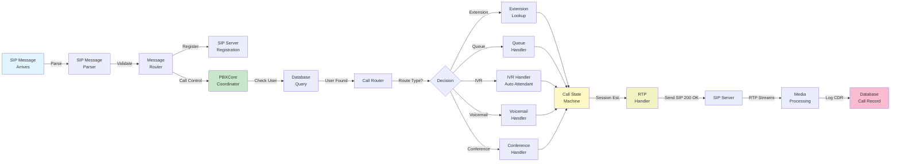
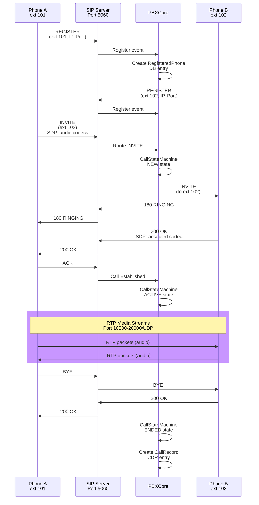
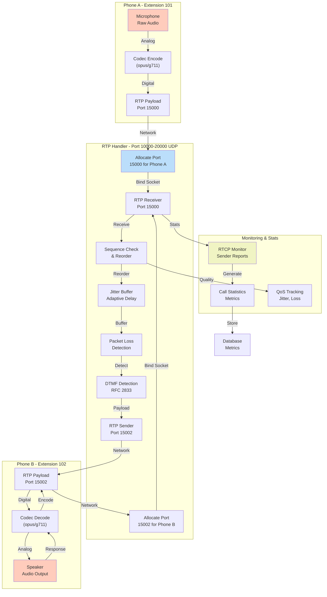

# Warden VoIP Complete Architecture Diagrams

**Document Version**: 1.0
**Date**: February 24, 2026
**Total Diagrams**: 6
**Format**: Mermaid Syntax (GitHub & Markdown Compatible)

---

## Table of Contents

### Part 1: System Overview (3 diagrams)
1. High-Level System Overview
2. Core Engine - Request Flow
3. Call Processing Pipeline

### Part 2: Network & Protocol (2 diagrams)
4. SIP Protocol Flow - Call Setup
5. RTP Media Stream - Detailed Flow

### Part 3: Core Architecture (1 diagram)
6. Module Dependency Graph

---

## Part 1: System Overview

### 1. High-Level System Overview

```mermaid
graph TB
    subgraph "External Systems"
        SIP_Trunks["SIP Trunks<br/>(AT&T, Comcast, etc)"]
        PSTN["PSTN"]
        WebUI["Web Browsers"]
        Phones["IP Phones<br/>(Registered Devices)"]
    end

    subgraph "Warden VoIP PBX"
        subgraph "Network Layer"
            SIP_Server["SIP Server<br/>(Twisted-based)<br/>Port 5060/UDP"]
            RTP_Handler["RTP Handler<br/>(Media Relay)<br/>Ports 10000-20000/UDP"]
        end

        subgraph "Core Engine"
            PBX_Core["PBXCore<br/>(Central Coordinator)"]
            CallRouter["Call Router"]
            CallStateMachine["Call State Machine"]
            FeatureInitializer["Feature Initializer<br/>(76 Modules)"]
        end

        subgraph "Features & Handlers"
            IVR["Auto Attendant<br/>(IVR)"]
            Voicemail["Voicemail Handler"]
            Queue["Call Queue"]
            Conference["Conference Bridge"]
            Paging["Overhead Paging"]
        end

        subgraph "REST API Layer"
            Flask_App["Flask App<br/>(Port 9000/TCP)"]
            API_Routes["22 Route Modules"]
            Auth["Authentication<br/>& Authorization"]
        end

        subgraph "Data Layer"
            Database["Database<br/>(PostgreSQL/SQLite)"]
            Models["ORM Models<br/>(SQLAlchemy)"]
            Migrations["Runtime Migrations"]
        end

        subgraph "Supporting Services"
            Config["Config Manager<br/>(YAML)"]
            Logger["Logger & Audit"]
            Security["Security<br/>& Encryption"]
            Metrics["Prometheus<br/>Exporter"]
        end

        subgraph "Integrations"
            AD["Active Directory"]
            Teams["Teams/Zoom/Jitsi"]
            CRM["Espo CRM"]
            Other["Other 3rd Party"]
        end
    end

    subgraph "Frontend"
        AdminUI["Admin Dashboard<br/>(Vite/TypeScript)<br/>Port 80/443"]
        State["State Management<br/>(Store)"]
        Pages["19 Page Modules"]
    end

    subgraph "External Services"
        TTS["Text-to-Speech<br/>(espeak, etc)"]
        Audio["Audio Processing<br/>(ffmpeg)"]
    end

    SIP_Trunks -->|SIP Messages| SIP_Server
    Phones -->|SIP Register/Call| SIP_Server
    SIP_Server -->|Process| PBX_Core
    PBX_Core -->|Route & Handle| CallRouter
    CallRouter -->|State Management| CallStateMachine
    FeatureInitializer -->|Load Features| IVR
    FeatureInitializer -->|Load Features| Voicemail
    FeatureInitializer -->|Load Features| Queue
    FeatureInitializer -->|Load Features| Conference

    CallStateMachine -->|Media| RTP_Handler
    RTP_Handler -->|RTP Streams| Phones
    RTP_Handler -->|RTP Streams| SIP_Trunks

    Flask_App -->|Manage| API_Routes
    API_Routes -->|Auth Check| Auth
    API_Routes -->|Query/Update| Models
    Models -->|ORM| Database
    Models -->|Create Tables| Migrations

    Config -->|Configure| PBX_Core
    Logger -->|Log| Database
    Security -->|Encrypt| Database
    Metrics -->|Export| Prometheus

    WebUI -->|HTTPS| AdminUI
    AdminUI -->|State| State
    State -->|Manage| Pages
    AdminUI -->|REST API| Flask_App

    PBX_Core -->|Sync| AD
    PBX_Core -->|Interop| Teams
    PBX_Core -->|Integration| CRM
    PBX_Core -->|Connect| Other

    CallStateMachine -->|Generate Audio| TTS
    RTP_Handler -->|Process| Audio
```

### 2. Core Engine - Request Flow Diagram

### 3. Call Processing Pipeline

```mermaid
graph LR
    subgraph "Step 1: Arrival"
        A["SIP Message<br/>arrives at port 5060"]
        B["Parse message<br/>extract headers"]
    end

    subgraph "Step 2: Authentication"
        C["Extract User ID<br/>from Request-URI"]
        D["Lookup in Database<br/>verify exists"]
    end

    subgraph "Step 3: Routing"
        E["Call Router<br/>analyzes destination"]
        F{Destination Type?}
        F -->|Extension| G["User Lookup"]
        F -->|Queue| H["Queue Handler"]
        F -->|IVR| I["IVR Handler"]
        F -->|VM| J["Voicemail"]
    end

    subgraph "Step 4: State Machine"
        K["Create CallStateMachine<br/>instance"]
        L["Transition: NEW"]
        M["Transition: RINGING"]
        N["Transition: ACTIVE"]
    end

    subgraph "Step 5: Media"
        O["RTP Handler<br/>allocate port"]
        P["Media Relay<br/>between peers"]
        Q["DTMF Detection<br/>RFC 2833"]
    end

    subgraph "Step 6: Features"
        R["Feature Hooks<br/>on_call_event"]
        S["Call Recording"]
        T["Call Monitoring"]
        U["Voicemail if no answer"]
    end

    subgraph "Step 7: Termination"
        V["BYE received<br/>or timeout"]
        W["CallStateMachine<br/>ENDED"]
        X["Create CallRecord<br/>CDR"]
        Y["Log Metrics<br/>Audit Trail"]
    end

    A -->|Parse| B
    B -->|Extract| C
    C -->|Validate| D
    D -->|Pass| E
    E -->|Analyze| F
    G -->|Route to| K
    H -->|Route to| K
    I -->|Route to| K
    J -->|Route to| K

    K -->|Init| L
    L -->|INVITE sent| M
    M -->|Answer received| N

    N -->|Start| O
    O -->|Stream| P
    P -->|Detect| Q

    N -->|Trigger| R
    R -->|Hook| S
    R -->|Hook| T
    R -->|Hook| U

    S -->|Active| P
    T -->|Active| P
    U -->|Fallback| P

    P -->|End Signal| V
    V -->|Complete| W
    W -->|Generate| X
    X -->|Record| Y

    style A fill:#ffccbc
    style F fill:#fff9c4
    style K fill:#c8e6c9
    style O fill:#bbdefb
    style R fill:#f0f4c3
    style W fill:#f8bbd0
```

---

## Part 2: Network & Protocol

### 4. SIP Protocol Flow - Call Setup

### 5. RTP Media Stream - Detailed Flow

---

## Part 3: Core Architecture

### 6. Module Dependency Graph - Core System

```mermaid
graph TD
    Main["main.py<br/>(Entry Point)"]

    subgraph "Configuration & Initialization"
        EnvLoader["utils/env_loader.py<br/>(Load .env)"]
        ConfigMgr["utils/config.py<br/>(Parse YAML)"]
        Logger["utils/logger.py<br/>(Setup Logging)"]
    end

    subgraph "Database Layer"
        DB["utils/database.py<br/>(SQLAlchemy)"]
        Models["models/__init__.py<br/>(ORM Models)"]
        Migrations["utils/migrations.py<br/>(Runtime DDL)"]
    end

    subgraph "PBX Core"
        PBXCore["core/pbx.py<br/>(PBXCore)"]
        CallRouter["core/call_router.py<br/>(Routing)"]
        CallStateMachine["core/call.py<br/>(State Machine)"]
        FeatureInit["core/feature_initializer.py<br/>(Feature Loader)"]
        TransferHandler["core/transfer_handler.py<br/>(Blind/Attended/REFER Transfer)"]
        CodecNegotiator["core/codec_negotiator.py<br/>(Phone Model & Codec Compat)"]
        RegistrationHandler["core/registration_handler.py<br/>(SIP Registration)"]
    end

    subgraph "Protocol Handlers"
        SIPServer["sip/server.py<br/>(Twisted SIP)"]
        SIPMessage["sip/message.py<br/>(SIP Parser)"]
        SDP["sip/sdp.py<br/>(SDP Negotiation)"]
        RTPHandler["rtp/handler.py<br/>(RTP Relay)"]
        JitterBuffer["rtp/jitter_buffer.py"]
        DTMFMonitor["rtp/dtmf_monitor.py<br/>(Unified DTMF: RFC2833/SIP INFO/in-band)"]
        RTCPMonitor["rtp/rtcp_monitor.py"]
    end

    subgraph "Feature Handlers"
        AutoAttendant["core/auto_attendant_handler.py<br/>(IVR)"]
        VoicemailHandler["core/voicemail_handler.py"]
        EmergencyHandler["core/emergency_handler.py<br/>(E911)"]
        PagingHandler["core/paging_handler.py"]
        Features["features/*.py<br/>(76 Modules)"]
    end

    subgraph "API Layer"
        FlaskApp["api/app.py<br/>(Flask Factory)"]
        Routes["api/routes/*.py<br/>(22 Modules)"]
        Schemas["api/schemas/*.py<br/>(5 Schema Modules)"]
        Auth["api/routes/auth.py<br/>(JWT)"]
        Errors["api/errors.py<br/>(Error Handler)"]
        OpenAPI["api/openapi.py"]
    end

    subgraph "Security & Monitoring"
        Security["utils/security.py<br/>(Encryption)"]
        TLS["utils/tls_support.py"]
        Middleware["utils/security_middleware.py"]
        Monitor["utils/security_monitor.py"]
        Metrics["utils/prometheus_exporter.py<br/>(Metrics)"]
        AuditLog["utils/audit_logger.py"]
    end

    subgraph "Integrations"
        AD["integrations/active_directory.py"]
        Teams["integrations/teams.py"]
        Zoom["integrations/zoom.py"]
        CRM["integrations/espocrm.py"]
    end

    subgraph "Utilities"
        GracefulShutdown["utils/graceful_shutdown.py"]
        Audio["utils/audio.py"]
        TTS["utils/tts.py"]
        DTMF["utils/dtmf.py<br/>(In-band DTMFDetector)"]
    end

    Main -->|Load Config| EnvLoader
    EnvLoader -->|Load Settings| ConfigMgr
    ConfigMgr -->|Initialize| Logger

    ConfigMgr -->|Connect| DB
    DB -->|Create ORM| Models
    Models -->|Create Tables| Migrations

    Main -->|Initialize| PBXCore
    ConfigMgr -->|Configure| PBXCore
    Models -->|Provide| PBXCore

    PBXCore -->|Own| CallRouter
    PBXCore -->|Own| FeatureInit
    PBXCore -->|Own| TransferHandler
    PBXCore -->|Own| CodecNegotiator
    PBXCore -->|Own| RegistrationHandler
    CallRouter -->|Use| CallStateMachine
    TransferHandler -->|Blind/Attended REFER| SIPServer
    RegistrationHandler -->|REGISTER dialogs| SIPServer

    PBXCore -->|Start| SIPServer
    SIPServer -->|Parse| SIPMessage
    SIPMessage -->|Negotiate| SDP
    SIPServer -->|Route Messages| PBXCore
    SIPServer -->|3xx Redirect Forwarding| CallRouter

    CallStateMachine -->|Handle Media| RTPHandler
    RTPHandler -->|Buffer| JitterBuffer
    RTPHandler -->|Detect DTMF| DTMFMonitor
    DTMFMonitor -->|In-band fallback| DTMF
    RTPHandler -->|Monitor Quality| RTCPMonitor

    FeatureInit -->|Load| AutoAttendant
    FeatureInit -->|Load| VoicemailHandler
    FeatureInit -->|Load| EmergencyHandler
    FeatureInit -->|Load| PagingHandler
    FeatureInit -->|Load| Features

    PBXCore -->|Trigger Events| Features

    Main -->|Create| FlaskApp
    FlaskApp -->|Inject| PBXCore
    FlaskApp -->|Register| Routes
    Routes -->|Validate| Schemas
    Routes -->|Check| Auth
    Routes -->|Catch Errors| Errors
    FlaskApp -->|Document| OpenAPI

    Routes -->|Query| PBXCore
    Routes -->|Access| Models

    PBXCore -->|Encrypt Data| Security
    Security -->|Use| TLS
    FlaskApp -->|Apply| Middleware
    FlaskApp -->|Monitor| Monitor
    Routes -->|Log| AuditLog

    PBXCore -->|Sync| AD
    PBXCore -->|Integrate| Teams
    PBXCore -->|Integrate| Zoom
    PBXCore -->|Integrate| CRM

    CallStateMachine -->|Use| Audio
    CallStateMachine -->|Generate| TTS
    CallStateMachine -->|Handle| DTMF
    PBXCore -->|Graceful| GracefulShutdown

    style Main fill:#ffccbc
    style PBXCore fill:#c8e6c9
    style FlaskApp fill:#bbdefb
    style SIPServer fill:#f0f4c3
    style Features fill:#fff9c4
```

---

## Architecture Principles

1. **Layered Design**: Clear separation between protocol (SIP/RTP), core logic, API, and frontend
2. **Pluggable Features**: 76 feature modules can be enabled/disabled independently
3. **Database-Backed**: All state persists to PostgreSQL or SQLite
4. **Stateless API**: REST API can scale horizontally
5. **Real-time Events**: SIP server processes calls synchronously; API handles async requests
6. **Security-First**: TLS, authentication, authorization, and encryption at all layers

---

## Document Information

- **Total Diagrams**: 6
- **Diagram Types**: Graph and Sequence (Mermaid `graph` and `sequenceDiagram`)
- **Total Components**: 100+ nodes across the six diagrams
- **Architecture Layers**: 7 (Network, Core, Protocol, API, Data, Features, Integration)
- **Lines of Mermaid Code**: ~500
- **Formats Available**: Markdown (.md)

## Viewing Instructions

- **GitHub/Web**: Diagrams render natively in browser
- **Local**: Use Mermaid CLI or online Mermaid editor for live rendering

> Additional diagrams that are planned but not yet written are tracked in
> [PLANNED_FEATURES.md](PLANNED_FEATURES.md).

---

*This document provides comprehensive visual documentation of the Warden VoIP PBX system architecture. For questions or updates, refer to the CLAUDE.md project guide.*
